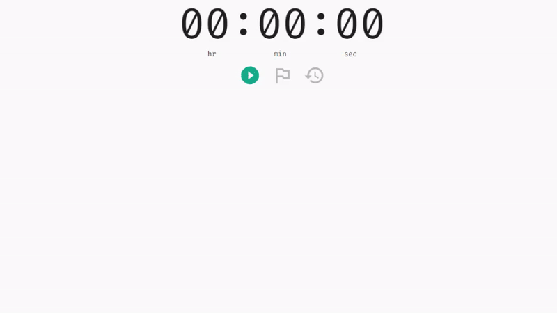

## Stopwatch using ReactJS and Material-UI

This project is to get hands on ReactJS and Material-UI. So I created a simple **Stopwatch** with functionality to create laps/splits.

### Actions Available

- Play or Pause the counter
- Create Laps
- Reset the Stopwatch

### Quick Demo

<kbd></kbd>

#### Any Suggestions ?

For any suggestion to improve this code, feel free to contact me.
Email :mailbox: : _`hjbrar7@gmail.com`_
LinkedIn :link: : <a href="https://www.linkedin.com/in/jinderbrar"> _`https://www.linkedin.com/in/jinderbrar`_ </a>
